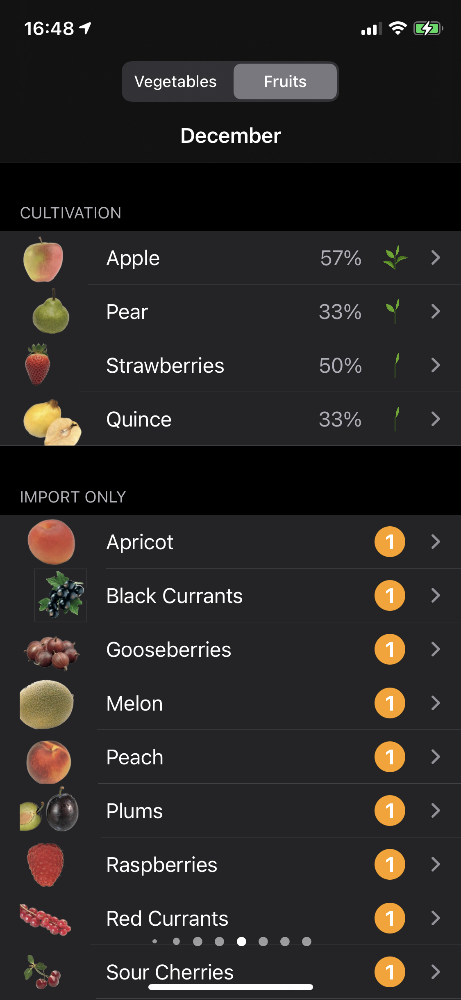
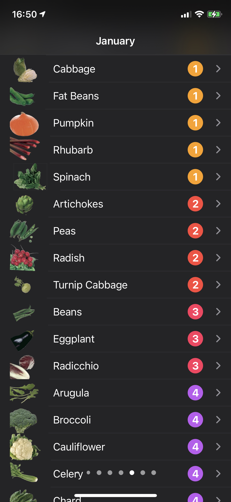
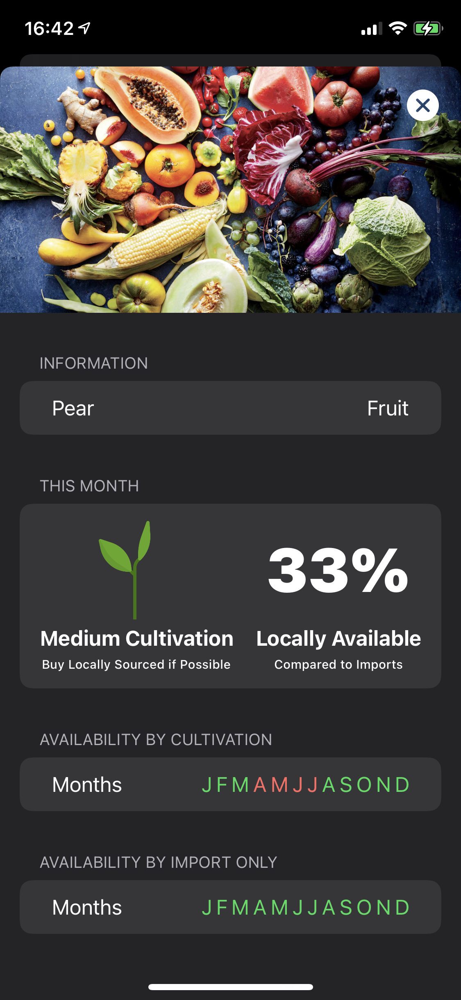

# Seasonal Calendar

### Seasonal regional fruit and vegetable calendar 

## Table of Contents

1. [Overview](#overview)
2. [Functionality](#functionality)
	- [Monthly Overview](#monthly-overview)
	- [Detailed Summary](detailed-summary)
3. [Data](#data)
	- [Availability](#availability)

## Overview

This is a seasonal calendar helping to inform which fruits and vegetables can be bought environmentally responsible. It shows how much import and local cultivation is available at the current time of the year for a specific region (see availability [here](#data)).

Based on [UTOPIA](https://utopia.de)'s Seasonal Calendar:

## Functionality

### Monthly Overview

This overview shows a list of all available produce for each month. It is sorted by import rate and cultivation amount. If a produce is solely imported, it is ranked in four stages and sorted in reverse.

> Fig. 1: Overview showing cultivation

> Fig. 2: Overview showing imports

### Detailed Summary

The detailed summary shows which in months the item is available and if it will be cultivated another time of the year.

> Fig. 3: Detailview for pear

> Fig. 4: Detailview for rhubarb

## Data

[Coutry data](https://unstats.un.org/unsd/methodology/m49/overview/) from the [UN Statistics Division](https://unstats.un.org/home/)

### Availability

At this time, only central Europe is supported.

* Germany: [Detailed import data](https://www.bzfe.de/_data/files/3488_2017_saisonkalender_posterseite_online.pdf) from [BZfE](https://www.bzfe.de)
